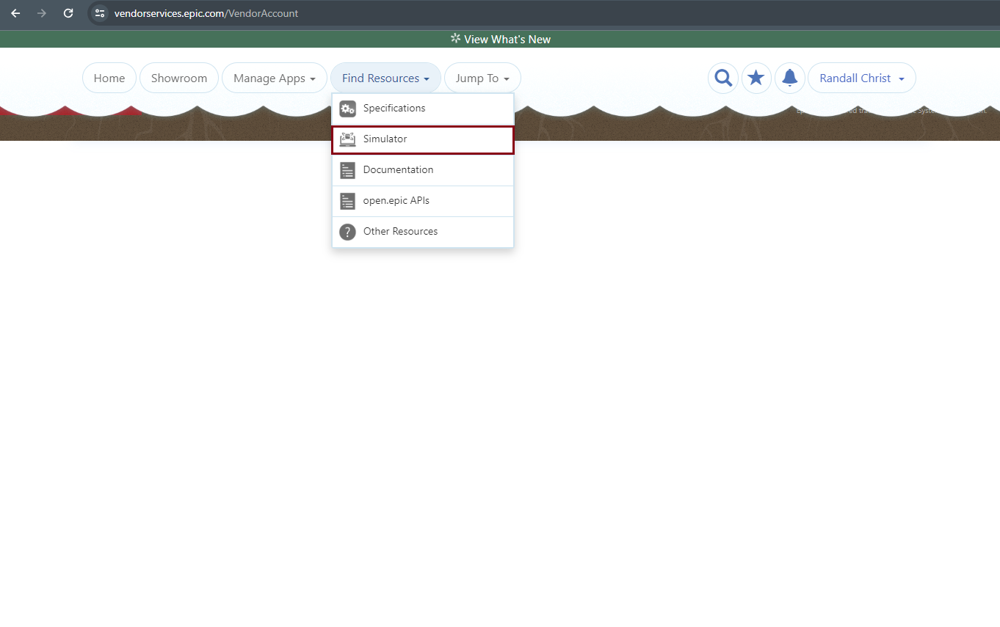
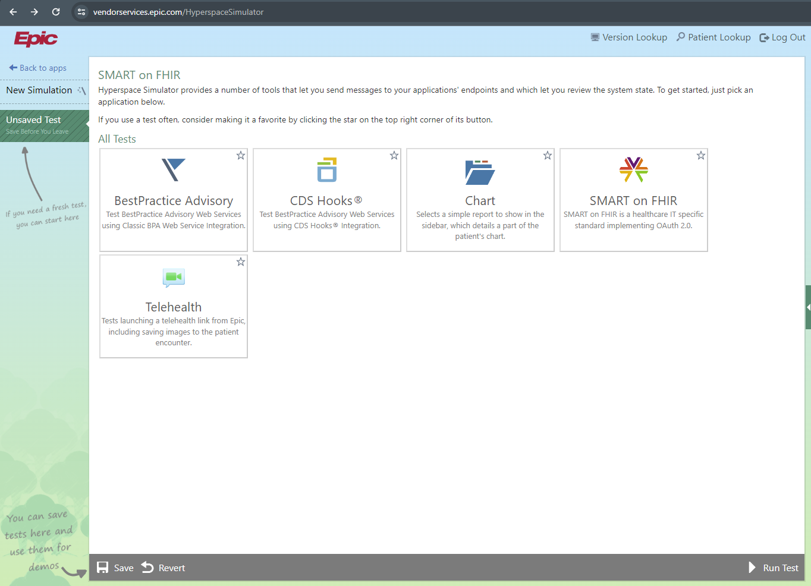
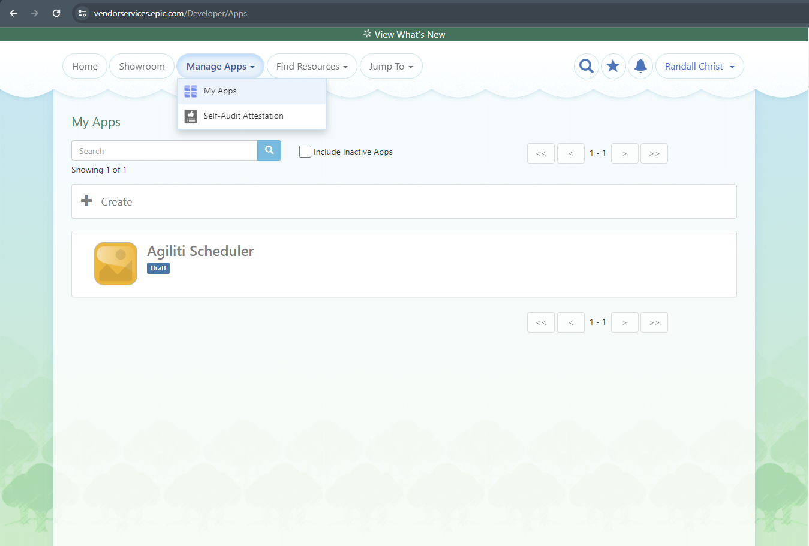
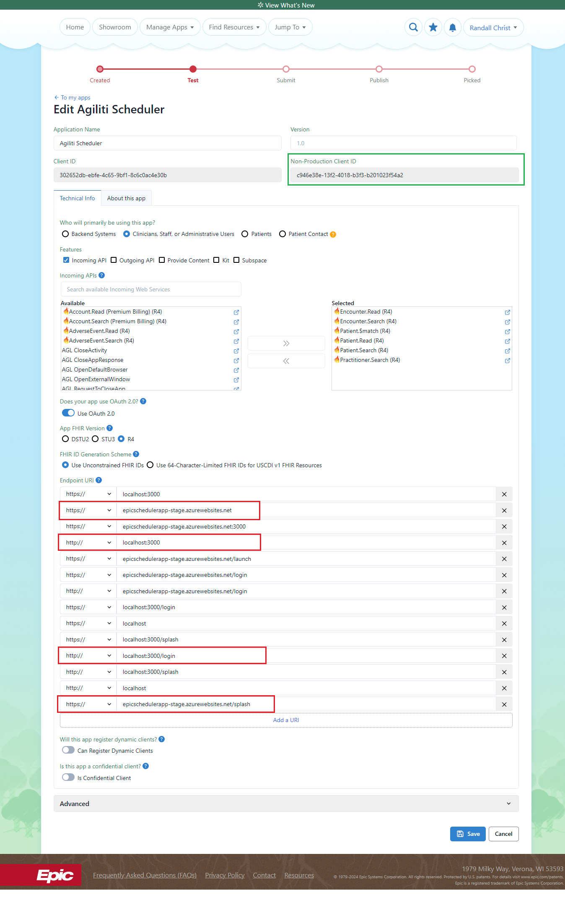

# Health Ordering/Reservation App

This app allows patients to order healthcare services and reserve appointments electronically.

It streamlines the process and improves convenience and access to care.

## Environment Setup

### Pre-requisites

- Node.js >= v16
- TypeScript
- React v18
- Vite >= v5

### Local Development

Install node modules for the client project.
```
cd client
npm install
```

Install node modules for the server project.
```
cd server
npm install
```

Run the client & server project at the same time.
```
npm run dev
```

Client: http://localhost:3000

Server: http://localhost:8000

### Epic Simulator

An EPIC simulator, also sometimes called an EPIC test environment or sandbox, is a simulation of Epic's electronic health record (EHR) software that allows independent developers to test and validate integration tools, applications, and services before deploying them into a live Epic production environment.

Epic Apps are standalone applications that are built by independent software vendors (ISVs) to integrate with and extend the functionality of Epic's electronic health record (EHR) system.

For an app to securely connect to Epic's APIs and interface with patient data, it needs a registered Client ID and corresponding Non-Production Client ID.

Non-Production refers to the fact that these credentials allow access only to Epic's non-production environments like test/sandbox instances, not live production systems used in healthcare facilities.






### Web Configuration

Not implemented yet for role-based authorization between Ordering and Reservation app

## Production Deployment

Build the client project by running the following commands.

It will bundle all dependencies, minifies JavaScript / CSS code and build the production version of the application in `client/build` directory.

```
cd client
npm run build
```

Build the server project by running the following commands.

```
cd server
npm run build
```

In production mode, the backend will be running on http://localhost:3000 and serve the frontend assets as well as APIs.

Finally, it'll be deployed by Azure pipeline.
